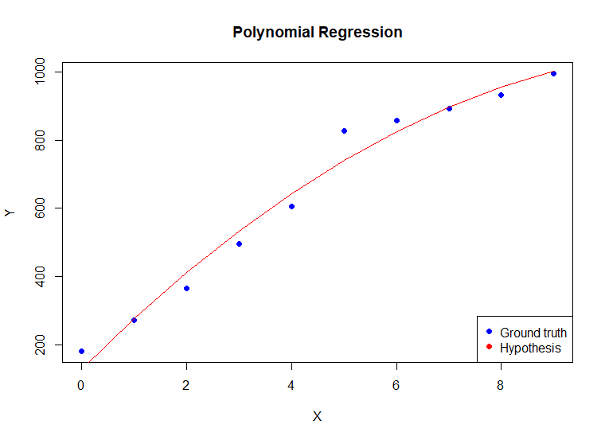

# Polynomial Regression

Code to perform polynomial curve fitting on a given data set and visualize the output.
The code calculates the learning rate depending upon the order of the output polynomial that the user desires.
(Works well for polynomials upto order 3-4, for higher order polynomials, the loss function diverges unless the learning rate is manually fed).
The code can handle both, inputs & outputs in terminal and from files.

## Format of Input.txt
* Line 1: Size of the sample data (Number of data points)
* Line 2: X data points
* Line 3: Y data points
* Line 4: Desired order of the output polynomial
* Line 5: Learning rate alpha (optional, if you want to use this then uncomment the corresponding lines in the PolynomialRegression.cpp)

## Format of Output.txt
* Column 1: X data points
* Column 2: Y data points
* Column 3: Hypothesis function yh for different data points

## How to run
1. Change the Input.txt file according to the desired data set
2. Change the working directory in Plot.r
3. Make sure Rscript.exe is added to PATH or else provide absolute path in Run.bat
4. Compile PolynomialRegression.cpp and execute Run.bat

 

## Example Output

